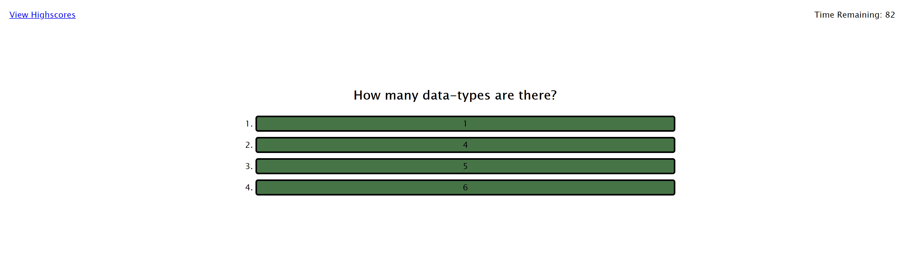

# 04-Web-APIs-Homework
Homework 4 - Web APIs - Coding Quiz

This site presents the user with a Code Quiz Challenge. When they press Start, they are presented with a series of questions related to web Development coding (specifically javascript fundamentals). This quiz is timed and they are penalized if they select an incorrect answer by time being deducted. If they run out of time, they are not given a chance to enter their score, as it would be 0. The score is the amount of time left at the end. 

I added a bonus deduction if they fail to enter their initials when prompted. 

After entering their initials, they are sent to a high-score page to see how they stack up. Scores are presented in order from highest to lowest. An option to start over or reset the score list is available. 

Scores are stored in "local-storage".

Overall Functionality: 
* 2 HTML pages, 2 Javascript files, 1 CSS file
* When site is visited, the main page gives an option to view the high scores page or start the quiz
* Series of 10 questions are presented
* If a question is answered incorrectly, 10 seconds is deducted from the timer
* If all questions are answered before time runs out, the player can enter their initials (Penalty of 5 seconds every time they click submit without entering info)
* Score and initials are saved in local storage and the user is directed to the high score page
* Option to reset the scores or Try again is presented

Screenshot: 

Links: 

* Repo - https://github.com/irv0735/04-Web-APIs-Homework---Coding-Quiz
* "Live Site" - https://irv0735.github.io/04-Web-APIs-Homework---Coding-Quiz/

